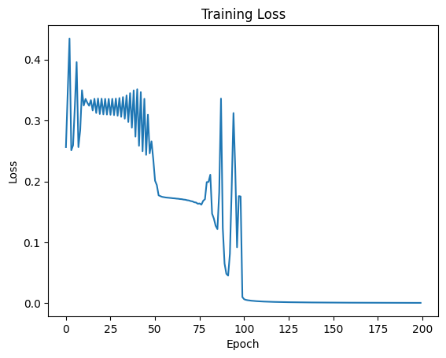

# Tiny Neural Network From Scratch — XOR Learning

A minimal feedforward neural network implemented entirely from scratch using pure Python and NumPy, without relying on deep learning frameworks such as TensorFlow or PyTorch.

This project demonstrates the internal mechanics of neural networks by manually implementing forward propagation, backpropagation, activation functions, and gradient descent to learn the non-linear XOR function.

---

## 🚀 Project Overview

The objective of this project is to understand neural networks at a fundamental level by building one from scratch instead of using high-level machine learning libraries.

Architecture:

- 2 Input Neurons
- 1 Hidden Layer with 2 Neurons
- 1 Output Neuron

The network is trained on the XOR dataset — a classic benchmark problem that requires non-linear learning capability.

---

## ✨ Key Features

- Neural network implemented completely from scratch
- No deep learning frameworks used (TensorFlow/PyTorch)
- Manual forward propagation
- Manual backpropagation
- Sigmoid activation function
- Gradient descent optimization
- Automatic dataset download via Python
- Loss tracking across training epochs
- Training loss visualization
- Binary classification using thresholding
- Achieves 100% training accuracy on the XOR dataset

---

## 🧠 Why XOR?

The XOR function is a classic problem in neural networks because:

- It is **not linearly separable**
- Cannot be solved using a single-layer perceptron
- Requires a hidden-layer representation to learn non-linear patterns

Successfully training a neural network on XOR demonstrates:

- Correct architecture design
- Proper backpropagation implementation
- Non-linear decision boundary learning

---

## 🏗 Neural Network Architecture

Input Layer (2 neurons)
↓
Hidden Layer (2 neurons)
↓
Output Layer (1 neuron)

Activation Function:

- Sigmoid

Loss Function:

- Mean Squared Error (MSE)

---

## 📊 Dataset

XOR dataset automatically downloaded during execution:

https://drive.google.com/file/d/1COa2Dc0St327gKyk3ar6XLqWvvWlOprL/view?usp=sharing

---

## ⚙️ Implementation Details

- Random weight initialization using NumPy
- Matrix-based forward propagation
- Manual gradient calculation for backpropagation
- Gradient descent parameter updates
- Binary prediction using threshold (0.5)

---

## 📈 Training Results

Training accuracy:

Training accuracy: 1.0

### Training Loss Visualization

Loss curve demonstrating convergence during XOR training.

---
